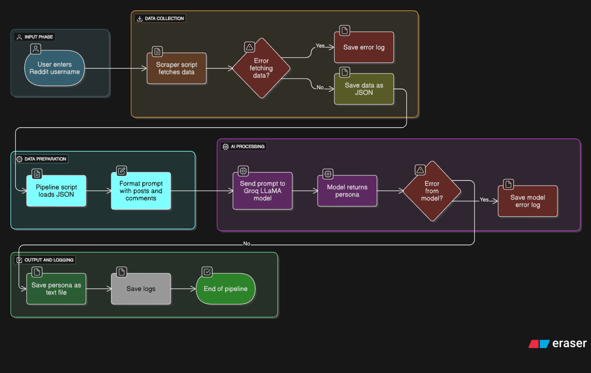

# 🧠 Reddit User Persona Generator

Generate structured personas from Reddit user data using LLMs and scraping pipelines.

---

## 📌 Project Overview

This tool automates the process of:

1. **Scraping a Reddit user's posts and comments**
2. **Sending the data to an LLM (e.g., Groq LLaMA)**
3. **Receiving a structured Jinja-style persona markdown template as output**

Useful for research, AI persona design, user modeling, or psychological profiling.

---

## ⚙️ Pipeline Flow


<p align="center">
  
</p>

```
[Reddit Username Input]
          ↓
   scraper.py (API or Pushshift)
          ↓
  data/{username}.json (saved)
          ↓
   pipeline.py (formats + sends to LLM)
          ↓
 output/{username}.txt (final persona)


```

---

## 🚀 How to Run

```bash
# 1. Clone the repository
git clone https://github.com/yourusername/UserPersonaGen.git
cd UserPersonaGen

# 2. Install dependencies
pip install -r requirements.txt

# 3. Run the pipeline
python pipeline.py

# 4. Enter Reddit username (without `u/`)
🔍 Example: kojied
```

The script will:

- Scrape posts/comments
- Save data to `data/{username}.json`
- Generate and save persona to `output/{username}.txt`

---

## 📁 Directory Structure

```
UserPersonaGen/
├── config.yaml              # Scraper settings (API usage, limits)
├── .env                    # Contains secrets (Reddit + Groq keys)
├── requirements.txt        # Required Python packages
├── scraper.log             # Logs for debugging
├── scrapper.py             # Reddit + Pushshift scraper
├── pipeline.py             # Main pipeline that calls LLM
├── data/
│   └── {username}.json     # Raw scraped Reddit data
├── output/
│   └── {username}.txt      # Final persona template
└── README.md               # You're reading it
```

---

## 🔐 .env Format (example)

Make sure your `.env` file looks like this:

```env
REDDIT_CLIENT_ID=your_id
REDDIT_SECRET=your_secret
REDDIT_USER_AGENT=script:reddit-scraper:v1.0 (by u/yourusername)

GROQ_API_KEY=your_groq_api_key
```

---

## 📓 Notes

- Uses `praw` for Reddit API, with fallback to Pushshift.
- Persona is returned in a Jinja2-compatible markdown format.
- Make sure your `.env` is **never pushed to GitHub** (add it to `.gitignore`).

---

## 🛠️ Built With

- Python 🐍
- PRAW & Pushshift 🔍
- Groq LLaMA (or any OpenAI-compatible LLM) 🤖
- Markdown + Jinja2 for templated output

---

## 🧠 Example Output (Jinja-style)

```markdown
**Username**: kojied  
**Core Themes**: Humor, nostalgia  
**Personality**: Sarcastic, imaginative  
**Writing Style**: Short, witty responses  
...
```

---

## 📬 Feedback or Contributions?

Open an issue or submit a pull request. Contributions welcome!
